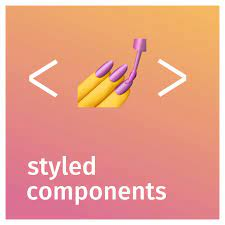
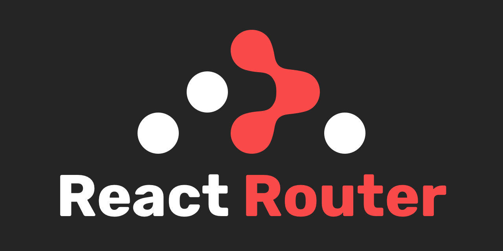

<div align="center">
  
</div>

<br />

Coffee Delivery é um projeto em React desenvolvido para pedidos de café online. Ele utiliza styled-components, react-router-dom, zod, react-hook-form, uuid, eslint e phosphor-icons. O projeto permite aos usuários adicionar e remover produtos do carrinho de compras.

## Ilustração


## Configuração

Para configurar o projeto localmente, siga estes passos:

1. Clone o repositório:
   ```text
   git clone https://github.com/alissonromaosantos/coffee-delivery.git
   ```
   
2. Navegue até o diretório do projeto:
   ```bash
   cd coffee-delivery
   ```

3. Instale as dependências usando o npm:
   ```bash
   npm install
   ```

4. Inicie o servidor de desenvolvimento:
   ```bash
   npm run dev
   ```

5. Abra seu navegador e visite `http://localhost:5173` para visualizar a aplicação.

## Uso

Assim que o projeto estiver configurado e em execução localmente, você pode interagir com a aplicação navegando por diferentes páginas usando os links ou botões fornecidos. Para adicionar um produto ao carrinho de compras, basta clicar no botão "+" ao lado da quantidade de itens adicionados no carrinho. Para remover um produto do carrinho de compras, clique no botão "Remover" dentro do carrinho.

Sinta-se à vontade para explorar a base de código e personalizar a aplicação de acordo com suas necessidades!

## Tecnologias







## Funcionalidades

- Adicionar produtos no carrinho de compras
- Remover produtos do carrinho de compras

## Deploy
```bash
https://coffee-delivery-psi-seven.vercel.app/
```

## Contribuições

Contribuições são bem-vindas! Se você tiver sugestões, melhorias ou correções de bugs, por favor, envie um pull request.

## Licença

Este projeto está licenciado sob a Licença MIT - consulte o arquivo [LICENSE](LICENSE) para mais detalhes.
